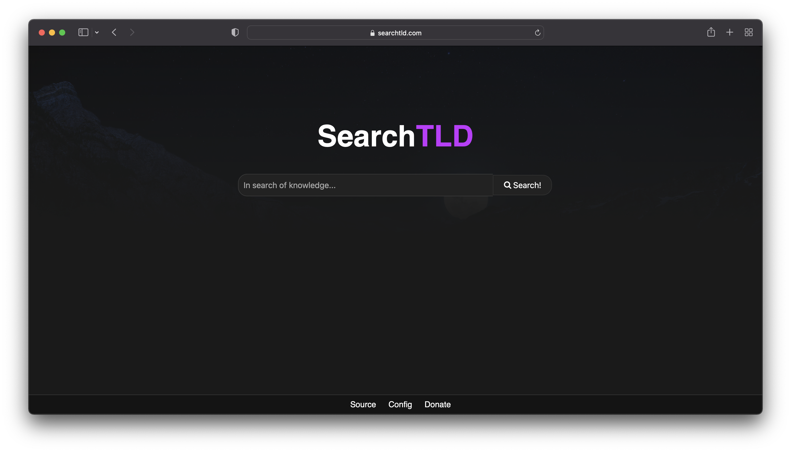

<h1>SearchTLD </h1>
<h3>Privacy Respecting and Fast Meta-Search Engine</h3>

  

  
  

# Self Hosting
There are [guides to self hosting on our blog](https://blog.searchtld.com)
or [our codeberg wiki!](https://codeberg.org/avitld/SearchTLD/wiki)

# Benefits of SearchTLD
<ul>
  <b>
  <li>Cleans URLs of tracking elements.</li>
  <li>Blocks harmful domains.</li>
  <li>Fallbacks to multiple search engines to ensure uptime.</li>
  <li>Rate Limiting for instances to protect against DDOS and Spam attacks.</li>
  <li>Redirect to privacy friendly frontends.</li>
  <li>Very easy to self-host using prepared install scripts.</li>
  <li>Special queries (IP, UserAgent, Base64 Encoding, etc.).</li>
  <li>Easy to use and beautiful UI.</li>
  <li>Advanced API with language settings and fallbacking.</li>
  <li>Libre JavaScript. (Not required)</li>
  <li>Works perfectly through tor.</li>
  <li>Fully open-source and protected under the AGPL v3.0.</li>
  </b>
</ul>

# Join our Matrix Server!
<b>We now also have a Matrix server which is preferred over IRC. 
You can join manually join ``#schizos:schizo.gr`` or through <a href="https://matrix.to/#/#schizos:schizo.gr">this link</a></b>
## Rules for Matrix
<ul>
  <li><b>Be nice to each other.</b></li>
  <li><b>Do not say/use any racial, sexist, homophobic/transphobic, antisemetic, xenophobic... slurs. </b></li>
  <li><b>If you have any questions, feel free to ask</b></li>
  <li><b>Do not spam the channel.</b></li>
</ul>

# Speed comparison: SearchTLD vs Other Search Engines

|  | SearchTLD | Google | DuckDuckGo | Bing | Yahoo | Yandex |
| --- | --- | --- | --- | --- | --- | --- |
| Requests | 14 | 216 | 50 | 330 | 50 | 139 |
| Time till website fully loaded | 2.04s | 42.66 s | 2.27s | 5.91s | 5.63s | 46.62 |
<a href="https://blog.searchtld.com/articles/full_comparison_of_searchtld_vs_other_meta-search_engines/">More info on this article</a>

# Read our news!
We now have a page dedicated to news about the website, including the source code of how we make the pages.
It's available [here!](https://blog.searchtld.com)

# Instances

If you run an instance of SearchTLD and want it placed on the list open an issue.

| URL | Country |
| --- | --- |
| [searchtld.com](https://searchtld.com) | 🇩🇪 DE |
| [emll.xyz](https://tld.emll.xyz/) | 🇸🇪 SE |

### Instance Rules
<ul>
  <li><b>Do not incorporate any proprietary code.</b></li>
  <li><b>Do not use cloudflare.</b></li>
  <li><b>Do not remove the original donation link.</b></li>
</ul>
