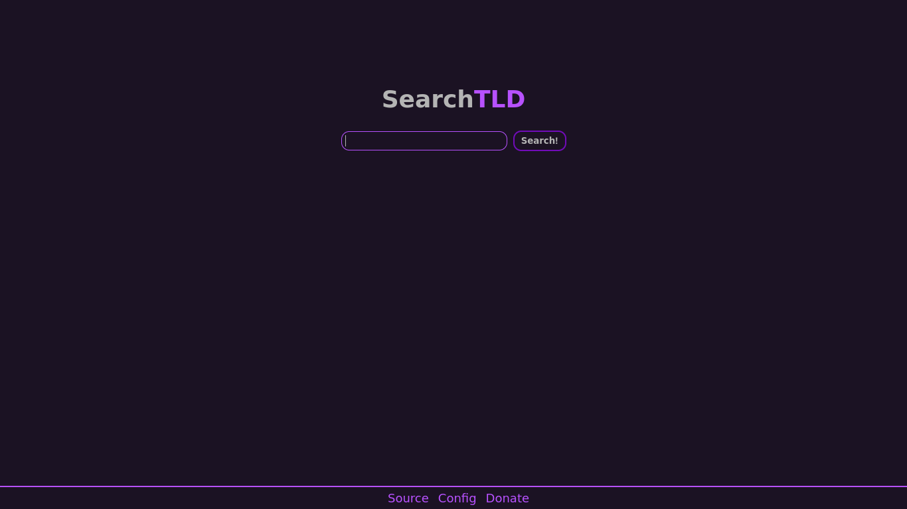

# SearchTLD
Privacy Respecting and Minimal Meta-Search Engine




# Self Hosting
If you want to self host then edit the *opensearch.xml* file according to your setup. <br/>
Not really perfect for self hosting yet, but works.

## Setup made easy.
There is now an automated script to set up SearchTLD in seconds!
Just run ``setup/setup-nginx.sh`` as root and follow the instructions.
This script will install all required dependencies (aside from the web server)
and set up SearchTLD.

Supported OS:

```
Fedora GNU/Linux
Debian GNU/Linux
Ubuntu GNU/Linux
Rocky GNU/Linux
```

### Dependencies
You will need php, php-fpm, php-xml and php-curl to run SearchTLD

## Instances

If you run an instance of SearchTLD and want it placed on the list open an issue.

| URL | Country |
| --- | --- |
| [Official Instance](https://search.schizo.gr) | 🇩🇪 DE |

### Instance Rules
Don't incorporate any code in JS or code that is closed-source.
Don't use a CDN.
